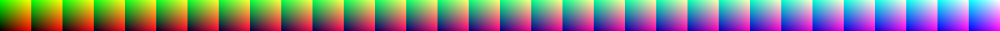

# LUT Texture Generator

Python script for generating LUTs of different sizes. It supports both Unreal Engine style LUT (top to bottom) and the Unity style (bottom to top).

Modified from a gist by [Koki Ibukuro](https://gist.github.com/asus4).

## Prerequisites

The script uses `cv2` and `numpy`, which can be installed using `pip`.

```bash
pip install opencv-python
pip install numpy
```

## Usage

The script can generate either a square layout or a long strip layout. Include `--flipy` for Unity style output.

```bash
python lut-generator.py --square 64 --flipy output.png

python lut-generator.py --strip 32 output.png
```

## Options

`-sq` `--square` use square format - accepted values `16`, `64`, `256`

`-st` `--strip` use strip format - accepted values `16`, `32`, `64`

`-fy` `--flipy` flip the image vertically

## Samples

| Size | Unreal | Unity |
| :--- | --- | --- |
| 256x16 |  |  |
| 1024x32 |  |  |

### Unity Style Layouts

- [strip 256x16](samples/unity/lut_strip_16_256x16.png)
- [strip 1024x32](samples/unity/lut_strip_32_1024x32.png)
- [strip 4096x64](samples/unity/lut_strip_64_4096x64.png)
- [square 64x64](samples/unity/lut_square_16_64x64.png)
- [square 512x512](samples/unity/lut_square_64_512x512.png)
- [square 4096x4096](samples/unity/lut_square_256_4096x4096.png)


### Unreal Engine Style Layouts

- [strip 256x16](samples/unreal/lut_strip_16_256x16.png)
- [strip 1024x32](samples/unreal/lut_strip_32_1024x32.png)
- [strip 4096x64](samples/unreal/lut_strip_64_4096x64.png)
- [square 64x64](samples/unreal/lut_square_16_64x64.png)
- [square 512x512](samples/unreal/lut_square_64_512x512.png)
- [square 4096x4096](samples/unreal/lut_square_256_4096x4096.png)